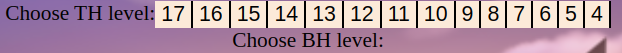
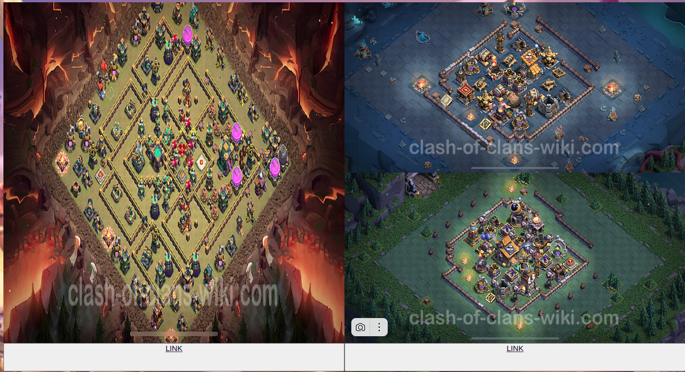
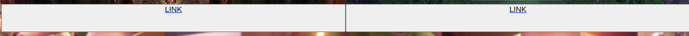

# Python_2024

Пиши в консоль `bash build.sh` (работает только на линукс/виртуальных машинах)

Наводись сюда

Выбирай уровень Ратуши и Дома строителя

Получай крутые расстановки

Жми ссылки под картинками, чтобы скопировать расстановку на свою базу

